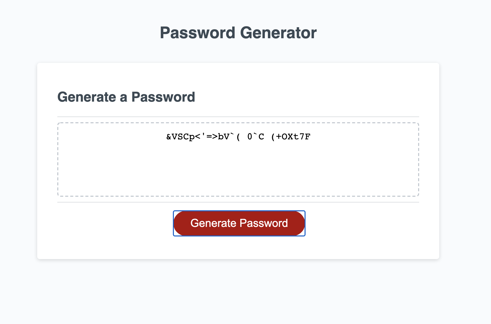

# password-generator

An webapp that allows users to generate password based on the length and criteria entered.

# How it works

User clicks on generate password button

User enters the length of the password.  Password length cannot be <8, empty or >128.

User then enters the criteria of the password.  One or more criteria needs to be selected (by clicking OK) to proceed further.

* Uppercase
* Lowercase
* Numbers
* Special characters

Unique password will be generated and displayed to the user as shown in the screenshot below.

# Screenshot

# Technology

* JS (in addition to the HTML and CSS that was provided).

# Deployed application URL

*  https://ciyer87.github.io/password-generator/
